# User Guide
This guide aims to serve as an entry point to our tool suite. 

# 0. Installation

Our tools are tested with [Eclipse Modeling Tools 2020-12](https://www.eclipse.org/downloads/packages/release/2020-12/r/eclipse-modeling-tools).

Please refer to the Eclipse documentation for more information on how to install and configure Eclipse.

After installing Eclipse, choose "Install new software" under "Help". 

Point the wizard to our update sites. Every release on our GitHub repository comes with a update site archive. 
Carefully read and accept the licensing and install the tools.

After restarting Eclipse, you should see a new menu "Thread Modeling" in your menu. If this is the case, you are good to go.

# 1. Creating Your First Model

In this guide, we will walk you through creating the evaluation example of CARDS, which is based on [CoCoME](https://cocome.org/).

At the end of this guide, your project should look roughly like our example project `de.uni_paderborn.swt.cards.examples.cocome`.

## 1.1 Instantiating Your Model

Start off by creating a new modeling project in your workspace by right-clicking the model explorer. Choose New > Modeling Project and choose a name for your project. In this example, we will use `de.uni_paderborn.swt.cards.examples.cocome`.

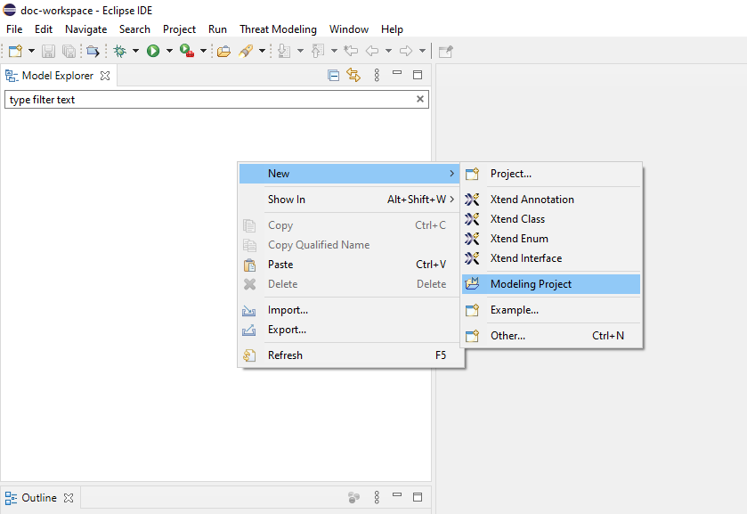

After the project was generated, open the `representations.aird` file inside the project and create a new model instance by pressing the `New` button under `Models`. Search for the `tmdsl` meta model and press next.

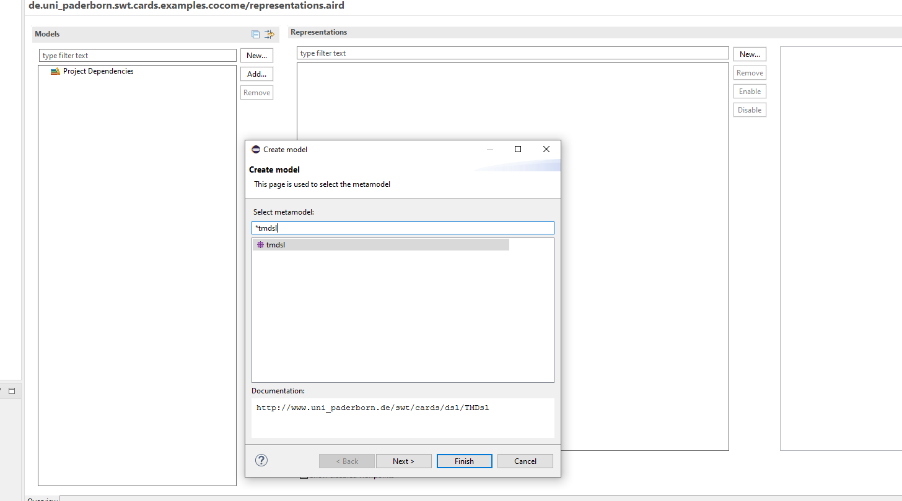

Choose `Model` as the root type and give your model file an appropriate name. We will name it `MyTmdsl.tmdsl` for now. Press `Finish` to generate your first model instance!

Your screen should now look roughly like this:

Enable the viewpoint by choosing `ComponentModel` in the `Representations` column and pressing enable.

Next, create a new representation of the model instance by selecting `ComponentModel diagram (0)` and pressing `New`.

Choose the diagram on the wizard and hit `Next >`.

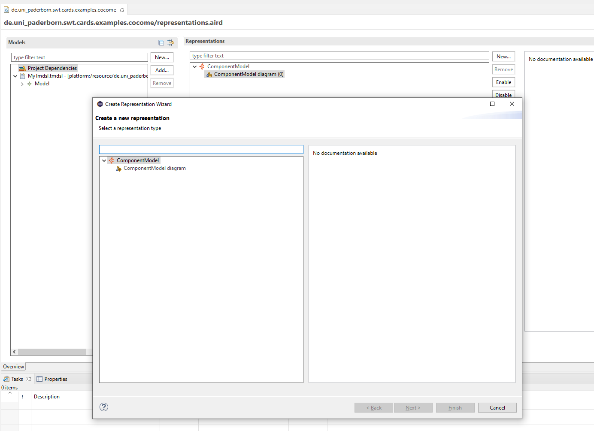

Chose the Model object as a semantic element, press `Finish` and give your representation a name. We will choose `CoCoMe Architecture CD` for this one.

The diagram should automatically be opened for you and you should be greeted by an empty model instance with some tools on the right hand side, roughly like this:

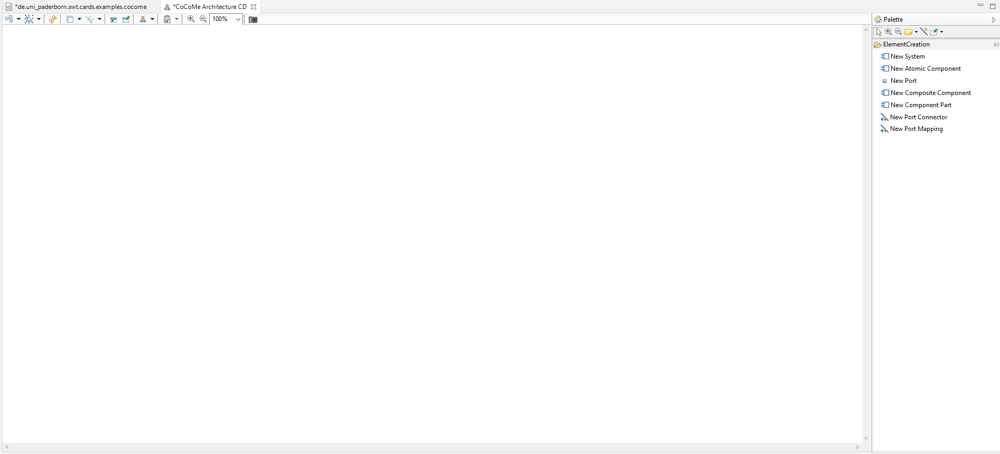

## 1.2 Creating a New System

Select the `New System` tool from the tools palette on the right hand side and select a large rectangle. 

You should be greeted by a dialog asking you to choose an existing mapping model for your model or to create a default model. You probably do not have a mapping model yet, so choose `Create Default`.

If everything went according to plan, you should now have a new System object in your model!

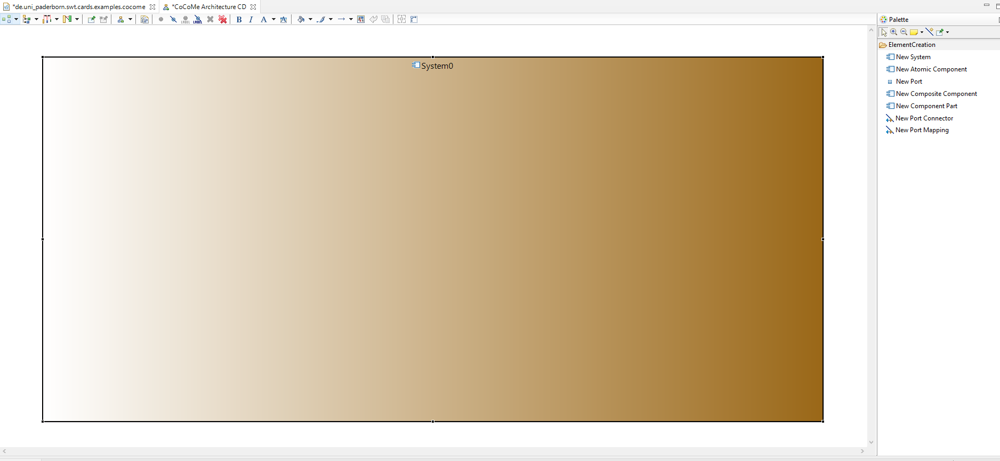

Systems come with a lot of properties in our editor, which we will explore along the way. For now, You can verify that the mapping model path was entered correctly and a mapping model was generated in the modeling project.

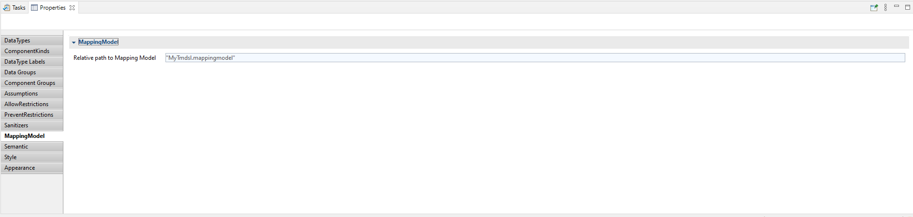

You can also choose to rename your System under the `Semantic` property view, but we will stay with `System0` for now.

## 1.3 Adding New AtomicComponents

In this example, we want to model a small shop system, consisting of a store, a cash desk and bank. Let's add some atomic components that model these building blocks of our system.

Similar to how we created a system, we can add an atomic component to the system. Select the `New Atomic Component` tool on the right hand side and draw a smaller rectangle inside the system.

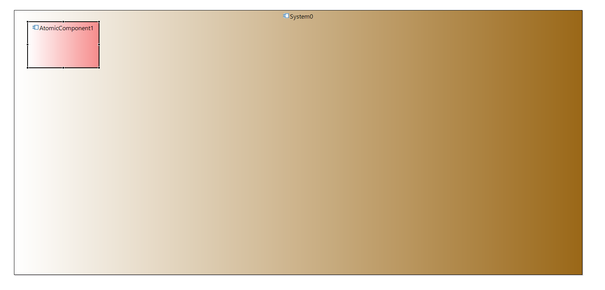

Let's quickly go over the different parameters of components. Under `Semantic`, you can find `Component Kinds`, `Name`, `Security Level` and `Source4 Data`. See our documentation on [Components](https://github.com/secure-software-engineering/cards/blob/develop/docs/ComponentModels.md#Component) or our paper for more information on these parameters.

We can change the name to `CardReader` here to model the card reader of a cash desk, but you can choose any name you prefer.

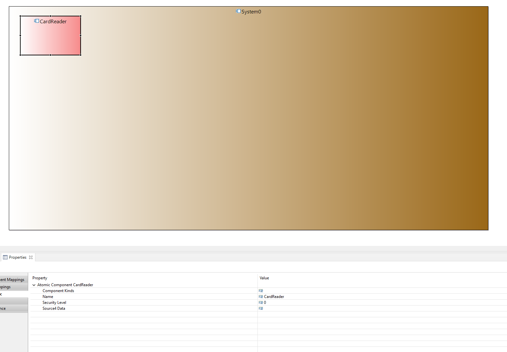

In our software system, the `CardReader` will have a connection to a `CashDeskPC`, so we will add a port to this component by selecting the `New Port` tool and clicking on the component. We will rename the port to `cardReaderPort`, similar how we renamed the component. The port should also be a INOUTPort, as data will flow in both directions, both in and out of the component. You can change this in the properties view of the port. 

It should look like this. Pay attention to the image of the port on the right side of the component, which should have arrows in both connections, symbolizing the INOUT port type.

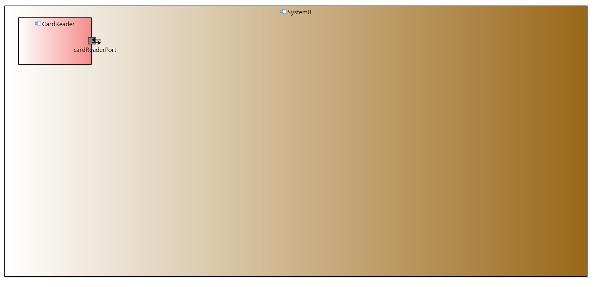

We will now add some more atomic components:
- ``CashBox`` with INOUTPort ``cashBoxPort``
- ``BarcodeScanner`` with OUTPort ``scannerPort``
- ``LightDisplay`` with INPort ``lightDisplayPort``
- ``Printer`` with INPort ``printerPort``
- ``CashDeskPC`` with 
  - INOUTPort ``pcCashBoxPort``,
  - INOUTPort ``pcCardReaderPort``,
  - INPort ``pcScannerPort``,
  - OUTPort ``pcPrinterPort``,
  - OUTPort ``pcLightDisplay``,
  - INOUTPort ``pcBankPort``,  
  - INOUTPort ``pcStorePort``

Your system should look roughly like this now:
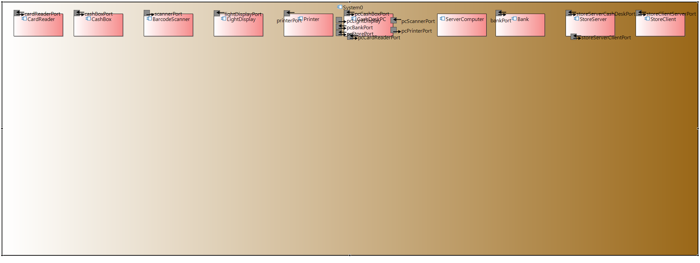

## 1.4 Adding Composite Components

We successfully defined component types, which can now be used in more complex component structures. To connect two components, we will need a composite component, so let's create a Cash Desk, which will house and connect the various cash desk components.

To create a composite component, choose the correct tool and draw another rectangle inside the system. We wil name the component `CashDesk`

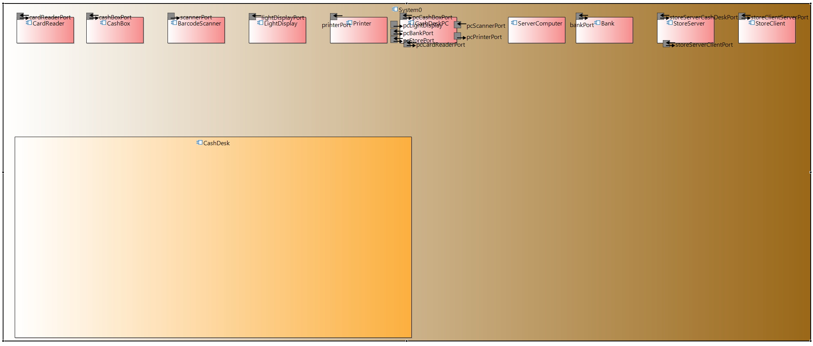

We want our cash desk to be able to communicate with the store server and a bank, so we can add two ports to this composite component, similar to how we added ports to atomic components. We create two INOUTPorts, ``cashDeskStoreConnector`` and ``cashDeskBankPort``.

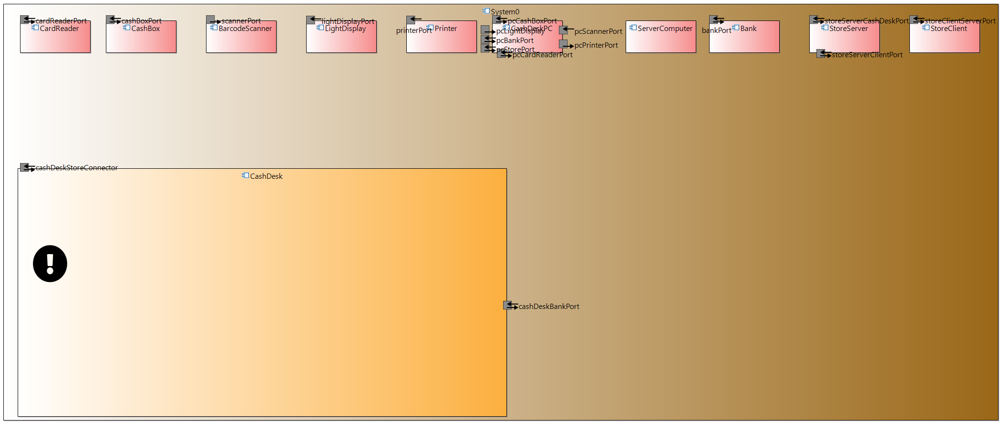

As you can see, a warning appears inside the composite component, which states the assumption, that the CashDesk component does not do anything with incoming/outgoing data on those ports, unless it is specified by connections.

An empty composite component is rather boring in itself. It has no ComponentPart to delegate our new ports to, so we will add a barcode scanner component part to the cash desk. Choose the `BarcodeScanner` component for this ComponentPart. You can also edit the name, but the default name is good for now.

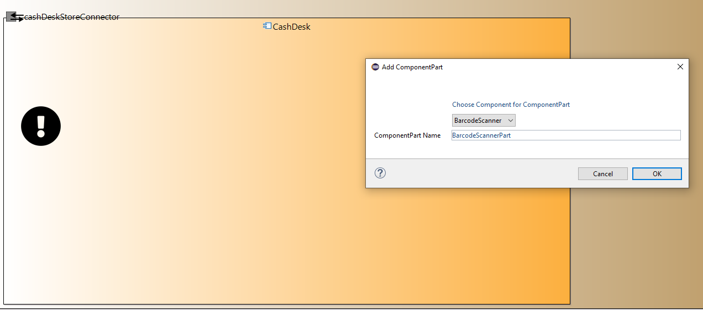

If everthing went correctly, the system should roughly look like this. Feel free to resize components and move ports at any time as you like, to get a more organzied look. 

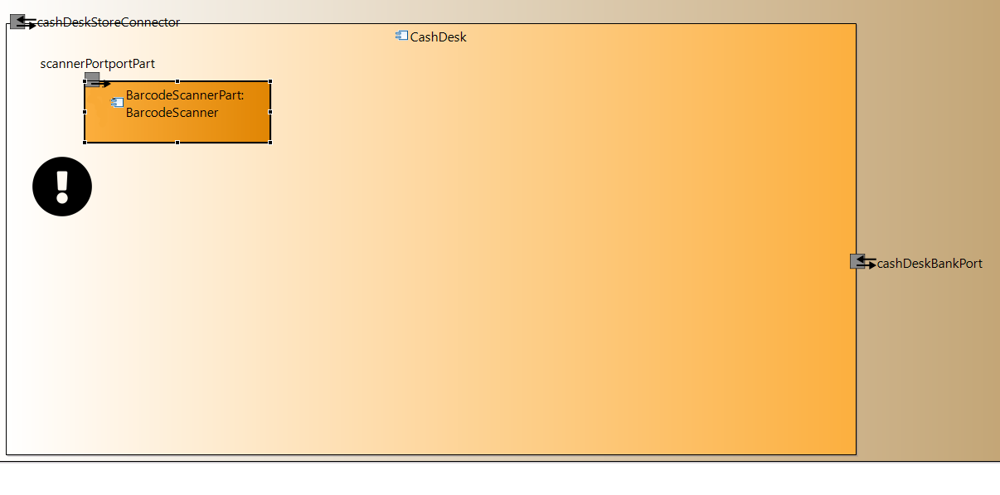

Now add some more component parts, one for ``LightDisplay``, ``Printer``, ``CashDeskPC``, ``CashBox`` and ``CardReader``

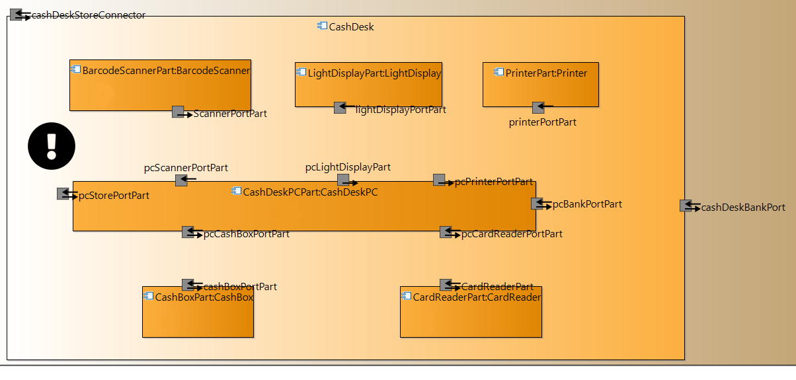

### 1.4.1 Port Mappings and Port Connections

To map a port of a composite component to the port of a component part, click on the `New Port Mapping` tool, then first click on the composite component port and then the port of the component part. 
We will connect the ``ChashDeskPC's`` ``pcBankport`` to the ``cashDeskBankPort`` of the ``CashDesk`` and connect the ``pcStorePort`` of the ``CashDeskPC`` to the ``cashDeskStoreConnector`` of the ``CashDesk``. It should look something like this: 

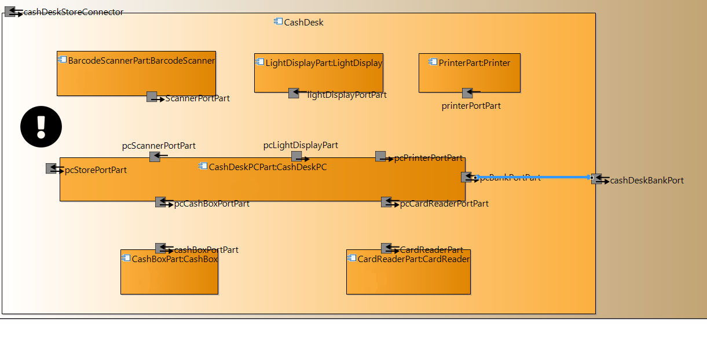

Port connectors can be used to connect component parts. We can connect the ports of the various parts to the respective counter part on the CashDeskPC. You can use the `New Port Connector` tool to achieve something that looks roughly like this:

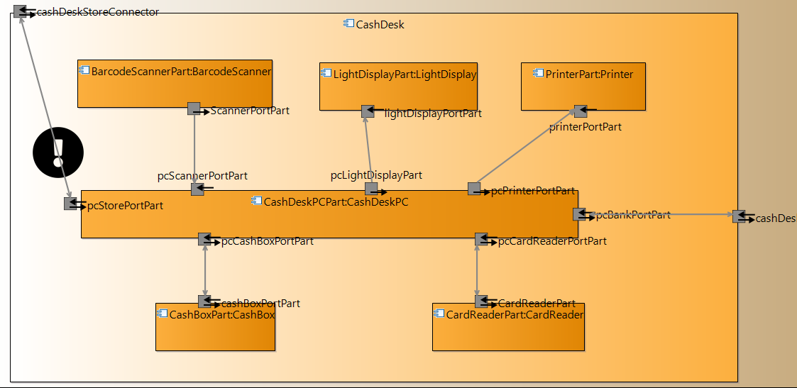

We have now modelled the server cash desk of our system. Let's add another composite component that will model the Store, which houses a store server, store client, bank and a cash desk.

Add a composite component called `Store`, then add 4 component parts to this component, one for the store client, store server, bank and the cash desk component. Connect the client to the server, cash desk to the server and cash desk to the bank.

Our completed system should roughly look like this:
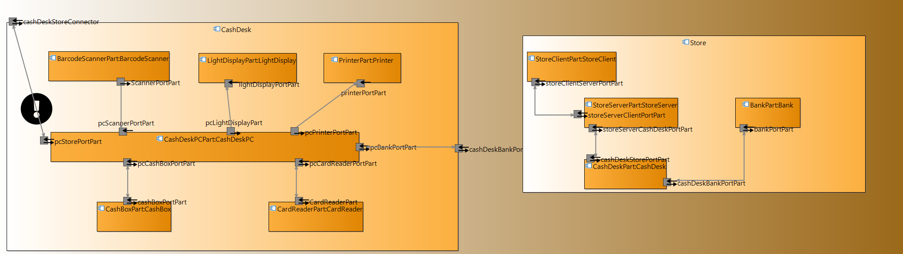

## 2. Security Definitions

You can start right here by using the model file `CashDeskComponents.tmdsl` from our example project.

Data types are defined in the properties view of the system object. In our software architecture, we will have the following data types:
- ``BarCode``, which will be "created" by the ``BarcodeScanner`` component,
- ``CreditCardNumber`` and ``CreditCardPin``, which will be "created" by the ``CardReader`` component,
- ``CashAmount`` will be generated by the ``CashBox``,
- ``ChangeAmount``, ``RunningTotal``, ``ProductPrice`` and ``ProductName`` will be generated by the CashDeskPC,
- ``ProductInfo`` will be generated by the StoreServer

We will create all DataTypes as Strings and ignore DataTypeLabels and security levels in this guide. 

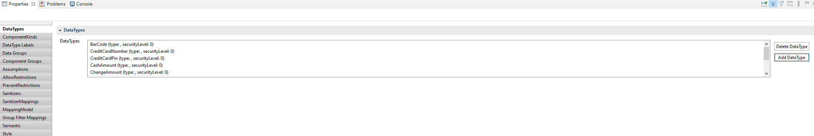

To define which component generates which data type, you can add the data type to the `Source4 Data` field under the `Semantic` property view of the component. If you added the data types as defined above, the system should look like this:

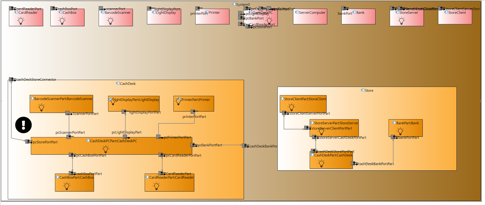

As you can see, all components that you added data types to, now have a little light bulb symbol on them. If you hover over one of them, you can see a tooltip which lists all the data types, which this component can have. They are always analyzed context specific. Every component can be used as part of arbitrary components and thus, handle different data types depending on the context. To reflect this, the tooltips always state the context of the component and list the corresponding data types.

These tooltips are also added to the component parts and components on the right. For example, the bank can access ``BarCode`` and other data, as those data types could theoretically be passed over the connections of this component.

## 2.1 Modeling Restrictions

You can start right here by using the model file `CashDeskDataTypes.tmdsl` from our example project.

Some data types (like the CreditCardPin), should not be passed on without constraints. In our case, we would never want the Pin to be passed to the printer and accidentally end up on the receipt for example.

To model restrictions, we first need to define a group of data, which should be restricted in some way. Groups are defined on the ``System`` object, we will first define a data group.

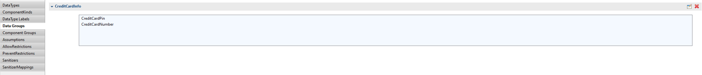

Next, let us add a sanitizer, which can be used to sanitize the data. Sanitizers are also added on the `System`.

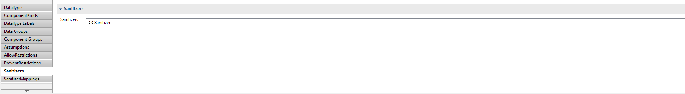

We can now add a restriction, which will tell the analysis, that we want to prevent all components from accessing the CreditCardInfo data group. We will also add a refinement, that will allow the CardReader, Bank and CashDeskPC to handle the data. Another refinement allows the Printer to read the data, if sanitized by the CCSanitizer (Note: You might find your credit card number, partly sanitized by asteriks, printed on your store receipts). If you are looking for more information on restrictions, please refer to the [documentation](https://github.com/secure-software-engineering/cards/blob/develop/docs/SeucurityDefinitions.md).

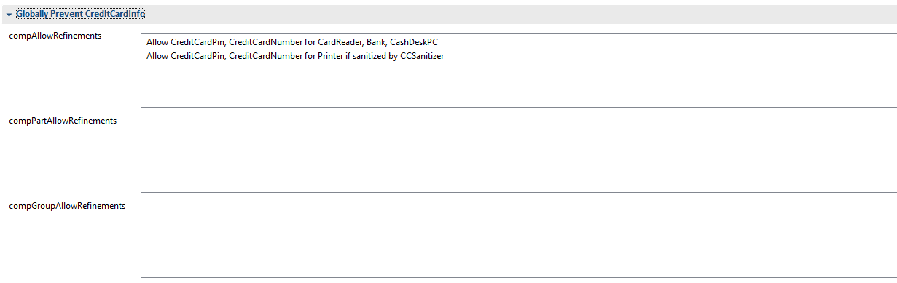

Let's validate the diagram by clicking `Validate diagram` in the context menu. Please note, that you need to right click the empty white space behind the `System` to reach this option.

You should see some errors on the UI, indicated by the small red icons in the upper right corner of components.

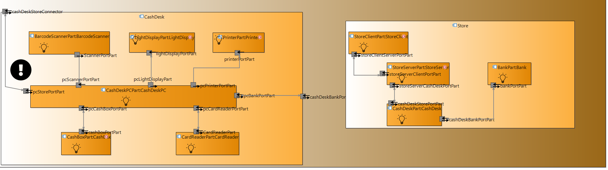

These violations are shown, because we do not restrict any dataflow, so the analysis propagates all data types on all edges. This way, the credit card info can reach basically every component which receives any data from the CashDeskPC.

## 2.2 Modeling Assumptions
You can start right here by using the model file `CashDeskRestrictions.tmdsl` from our example project.

Assumptions are facts that we can assume to be implemented in our system. In this case, we need to model several assumptions to satisfy our restrictions. 

Assumptions are defined in the `Assumptions` tab under the `System's` property view. To satisfy the constraints, different sets of assumptions might be suitable and model different solutions. You can try to find the right assumptions and check your solution by re-validating the model. One example solution would be the following.

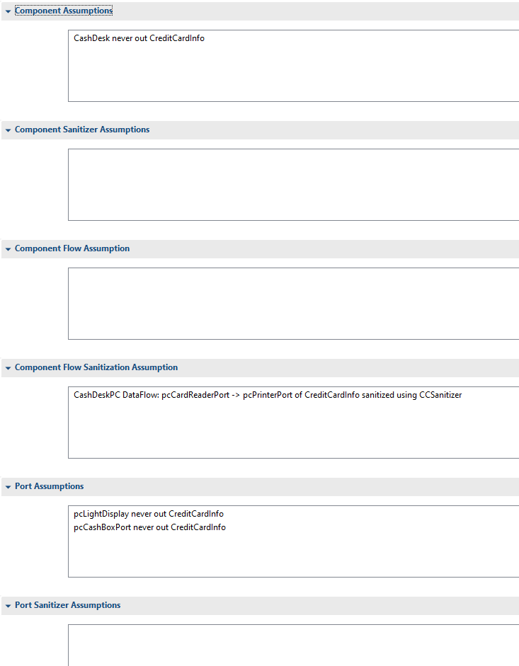

After re-validating the diagram, the violations are gone.

This concludes our modeling guide. The model file `CashDesk.tmdsl` of our example project represents one possible solution to this guide.

# 3. Generating HTML Reports

HTML reports can be a useful tool for developers, as they easily list restrictions, assumptions, violations and even the actual analysis traces for reference. 

To generate a report, use the option `Export report` of the `ThreatModeling` context menu when clicking anywhere in the editor window.

You can also use the export wizard to generate reports for multiple models at once.

# 4. Generating Source Code

We provide functionality to generate basic glue code to easily get started with implementing the system model. The code is always generated on a per composite comopnent basis and covers the whole component tree for a specific composite component. This enables the developer to only implement part of a system using our code.

In our example, we will generate code for the whole System, which in our case, is modeled in the `Environment_CC` composite component.  
To do this, simply right click on the component and click the `GenerateSourceCode` option under our `ThreatModeling` context menu.

This will immediatly create a new java project in your workspace.

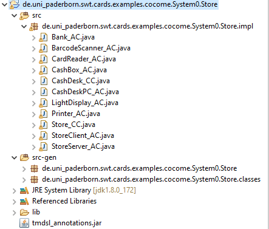

As you can see, we provide two src folders, one for generated code and one for the actual implementation. Feel free to explore the `src-gen` folder, but please note, that any changes might be overwritten, if you invoke the source code generation again.

## 4.1 Remarks

- Every component is a Thread
- Every port is either an Observer, Observable or both
- Connections and Mappings are already set up

## 4.2 Composite Component code

This section will give a brief overview for the composite component code.

### 4.2.1 Lifecycle

In the constructor, the very first thing that is run, is your own `init` method. You can add any initialization code here. After that, ``ports`` and ``componentParts`` are initialized and ``connections`` are set up. 

You can now run a composite component using the standard `start` method of java threads. A composite component will automatically start all child components and handle mappings. Additionally, your own `processComponent` is executed in this thread.

You can stop components using `stopComponentThread`, this is also where your own `beforeStop` method is executed.

### 4.2.2 Implementation

For a working example, all you need to do is add some code to the `processComponent` method. You could of course also restrict all business logic to component parts. To access ports, use the `readData` and `writeData` of the component's ports. 

## 4.3 Atomic Component code

### 4.3.1 Lifecycle

The lifecycle of atomic components is similar to composite components. The only difference is, that we do not initialize any componentParts and these components do not handle connections.

### 4.3.2 Implementation

For a working example, all you need to do is add some code to the `doSomething` method. To access ports, use the `readData` and `writeData` of the component's ports. 

## 4.4 Sanitizer
We do not currently provide any support for generating Sanitizers, so sanitizer methods would have to be declared by hand and need to be added to the mapping model manually as well.
